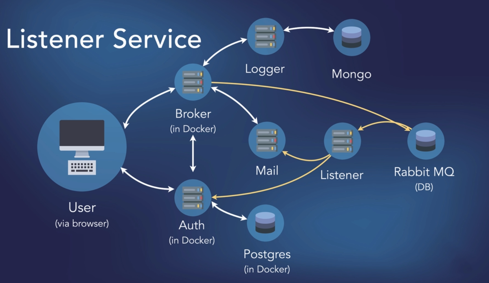

## Microservices cluster

This project was realized as generic cluster with the following architecture.

Communication inter-services (not databases or async queues) are made with 3 different communcation techniques transmited over HTTP requests
- standard JSON
- RCP calls
- gRCP calls

These methods can be switched by using different definied functions in the routes of each service, changing the method of communication (they need to be the same at both ends)
